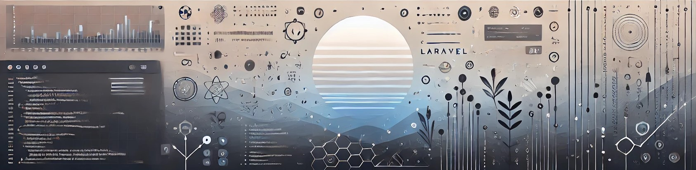

# 💫 Hi, I’m **Michael Yogy Manginsela** a.k.a **Ochitsuki** 💫

---

I’m a passionate **full-stack developer**, and I love creating both backend and frontend solutions. I enjoy building smooth, user-friendly applications and tackling complex problems through code.
  
In the backend, I primarily work with **Laravel** and **Node.js**, and on the frontend, I’m experienced in **HTML, CSS, JavaScript**, and **Flutter** for mobile apps. I also handle **MySQL** and **MongoDB** for database management. Tools like **Git** and **Docker** are a big part of my workflow to ensure smooth development processes.
  
When I’m not coding, I draw inspiration from nature – I love sunset landscapes. They remind me to balance creativity with precision in my work. I’m always curious about new technologies and excited about finding ways to improve and push boundaries.
  
Feel free to connect with me – I’m always up for new projects and challenges!

---

# 🌐 My Social Media:
 
 
 

---

# 💻 My Tech Skills:

 
 
 
 
 
 
 
 
 
 

---

# 📊🏆 GitHub Stats & Trophies 🏆📊:

 

---

---
<!--
### 🔝 Top Contributed Repo

---
-->

---
